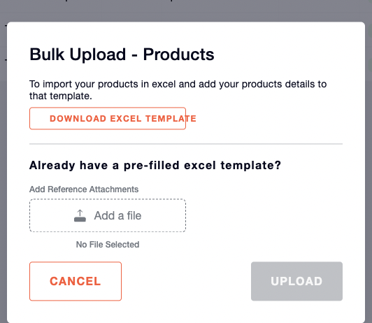

# Product APIs

### Product Details API
- **API Description**: Fetches the product level details.
- **Rest URL**: /api/ims/v1/products/details
- **Request Type:** GET

#### Query params
|**Field**|**Description**|**Datatype**|**Mandatory**|**Example**|
| :- | :- | :- | :- | :- |
|merchantId|Seller Id|String|Yes|<p></p><p>0541d94f-d590-5</p>|
|inventoryId|Product Identifier|String|Yes|A024-C432D0C80D33920F|

Curl
```bash
curl --location --request GET '{dns}/api/ims/v1/products/details?merchantId=0541d94f-d590-5&inventoryId=A024-C432D0C80D33920F' \
--header 'Content-Type: application/json' \
--data '{
}'
```
#### Response
200
```json
{
  "productBaseDetails": {
    "inventoryId": "A024-E87F8329D897FEE0",
    "name": "Smartphone X12",
    "status": true,
    "productImage": {
      "id": 101,
      "documentName": "smartphone_x12_front_view.jpg",
      "documentCategory": "Product Images",
      "documentSubCategory": "Front Views",
      "documentLink": "https://example.com/images/smartphone_x12_front.jpg",
      "notes": "Front view of Smartphone X12"
    },
    "sku": "SKU12345X12",
    "barcode": "0123456789012",
    "platformId": "PLATFORM123",
    "platformName": "Online Store",
    "storeListingId": "LIST12345X12",
    "itemType": "INVENTORY",
    "category": {
      "id": 10,
      "name": "Electronics",
      "description": "Electronic devices and accessories",
      "parentCategoryId": 0,
      "channelId": "CHANNEL1"
    },
    "vertical": {
      "id": 5,
      "name": "Smartphones",
      "description": "High-end smartphones",
      "parentCategoryId": 10,
      "channelId": "CHANNEL1"
    },
    "merchantId": "MERCHANT123",
    "description": "Latest model with advanced features, 128GB storage, 8GB RAM.",
    "itemValue": 999.99,
    "price": 1099.99,
    "syncedToOracle": false
  },
  "productFulfillmentDetails": {
    "customPackagingInventory": false,
    "bundled": false,
    "dangerous": false,
    "lotManaged": true,
    "digital": false,
    "pickedAsWhole": true,
    "shelfLifeEnabled": false,
    "minimumShelfLife": 0,
    "packagingItemType": "Box",
    "packagingType": "Standard",
    "serialized": true,
    "length": 15,
    "width": 8,
    "height": 1,
    "weight": 0.5,
    "volume": 120,
    "dimensionUnit": "cm",
    "weightUnit": "kg",
    "productMsdsFile": {
      "id": 201,
      "documentName": "smartphone_x12_safety_manual.pdf",
      "documentCategory": "Manuals",
      "documentSubCategory": "Safety Manuals",
      "documentLink": "https://example.com/manuals/smartphone_x12_safety.pdf",
      "notes": "Safety manual for Smartphone X12"
    },
    "profiled": true,
    "defaultReorderPoint": 50,
    "fai": false
  },
  "productConfigurableDetails": {
    "hsCode": "851712",
    "tariffValue": 0,
    "tariffDescription": "Smartphones",
    "reversePickupReturnPreference": "Accepted",
    "returnToSenderFromCourierReturnPreference": "Return to Warehouse",
    "backActionForInspectionFails": "Return to Vendor"
  },
  "productInventoryDetails": {
    "totalOnHand": 500,
    "totalUnsellable": 5,
    "warehouseIdToInventoryDetailMap": {
      "WH123": {
        "label": "Main Warehouse",
        "name": "Warehouse A",
        "active": true,
        "onHand": 300,
        "committed": 150,
        "reorderPoint": 100
      },
      "WH124": {
        "label": "Secondary Warehouse",
        "name": "Warehouse B",
        "active": true,
        "onHand": 200,
        "committed": 50,
        "reorderPoint": 75
      }
    }
  },
  "productBundleDetails": {
    "groupId": "BUNDLE123",
    "mergeOrigin": "Factory Assembly",
    "bundleInventoryMetaInfoList": [
      {
        "inventoryId": "INV12346",
        "productImage": {
          "id": 102,
          "documentName": "smartphone_x12_case.jpg",
          "documentCategory": "Product Images",
          "documentSubCategory": "Accessories",
          "documentLink": "https://example.com/images/smartphone_x12_case.jpg",
          "notes": "Smartphone X12 Protective Case"
        },
        "name": "Smartphone X12 Protective Case",
        "platformId": "PLATFORM123",
        "platformName": "Online Store",
        "quantity": 1,
        "barcode": "0123456789013",
        "sellerSku": "SKU12345X12-CASE"
      }
    ]
  },
  "extraParams": {
    "param1": "value1",
    "param2": "value2",
    "param3": "value3"
  },
  "message": "Product details retrieved successfully",
  "status": true,
  "statusCode": "200"
}
```

400
```json
{
  "timestamp": "2024-03-07T08:32:01.783946867",
  "errorReasonCode": "BAD_REQUEST_EXCEPTION",
  "status": "BAD_REQUEST",
  "message": "No Product Exists with inventoryId : B277-060B7563FAF599",
  "requestId": "65e97b817e2fb9feb40afb61883cab5a",
  "errors": [
    "BAD_REQUEST_EXCEPTION"
  ]
}
```

### Product Listing Page
- **API Description**: Fetches list of products to be displayed on the Inventory -> Products listing page.
- **Rest URL**: /api/ims/v1/products/listing
- **Request Type:** POST

#### Query params
|**Field**|**Description**|**Datatype**|**Mandatory**|**Example**|
| :- | :- | :- | :- | :- |
|pageNo|Page Number|integer|no|1|
|pageSize|Page Size|integer|no|100|

#### Header params
|**Field**|**Description**|**Datatype**|**Mandatory**|**Example**|
| :- | :- | :- | :- | :- |
|languageCode|Language|string|yes|en|

#### Request
```json
{
  "merchantIds": [
    "string"
  ],
  "filterParams": {
    "productLike": "string",
    "productActiveStatus": true,
    "customPackagingInventory": true,
    "serialised": true,
    "lotManaged": true,
    "dangerous": true,
    "digital": true,
    "bundled": true,
    "channelId": "string"
  },
  "sortParams": {
    "sortBy": "string",
    "sortOrder": "string"
  },
  "sortEnabled": true,
  "extraParams": {
    "additionalProp1": "string",
    "additionalProp2": "string",
    "additionalProp3": "string"
  }
}
```
|**Field**|**Description**|**Datatype**|**Mandatory**|**Example**|
| :-: | :-: | :-: | :-: | :-: |
|merchantIds|List of merchantIds|List of strings|Yes|["merchant123"]|

#### filterParams
|**Field**|**Description**|**Datatype**|**Mandatory**|**Example**|
| :-: | :-: | :-: | :-: | :-: |
|productLike|Filter by product name/ SKU|string|No|"SKU"|
|productActiveStatus|Filter by product active status|boolean|No|true|
|customPackagingInventory|Filter by custom packaging inventory|boolean|No|true|
|serialised|Filter by whether the product is serialised|boolean|No|true|
|lotManaged|Filter by whether the product is lot managed|boolean|No|true|
|dangerous|Filter by whether the product is marked as dangerous|boolean|No|true|
|digital|Filter by whether the product is digital|boolean|No|true|
|bundled|Filter by whether the product is bundled|boolean|No|true|
|channelId|Filter by channel identifier|string|No|"CHANNEL1"|

#### sortParams
|**Field**|**Description**|**Datatype**|**Mandatory**|**Example**|
| :-: | :-: | :-: | :-: | :-: |
|sortBy|The field to sort by|string|No|"name"|
|sortOrder|The order to sort in|string|No|"ASC" or "DESC"|

#### extraParams
|**Field**|**Description**|**Datatype**|**Mandatory**|**Example**|
| :-: | :-: | :-: | :-: | :-: |
|additionalProp1|Additional parameter 1 for extra information|string|No|"value1"|
|additionalProp2|Additional parameter 2 for extra information|string|No|"value2"|
|additionalProp3|Additional parameter 3 for extra information|string|No|"value3"|

#### sortEnabled
|**Field**|**Description**|**Datatype**|**Mandatory**|**Example**|
| :-: | :-: | :-: | :-: | :-: |
|sortEnabled|Flag to enable sorting of results|boolean|No|true|

Curl
```bash
curl --location '{dns}/api/ims/v1/products/listing' \
--header 'languageCode: en' \
--header 'Content-Type: application/json' \
--data '{
    "merchantIds": [
        "b9b50e15-e8e2-5"
    ],
    "filterParams":{"productActiveStatus":true}
}'
```
#### Response
```json
{
  "productMetaDetailList": [
    {
      "merchantId": "merchant123",
      "inventoryId": "INV000123",
      "sku": "SKU123456",
      "itemType": "INVENTORY",
      "productName": "Smart LED TV 50inch",
      "barcode": "0123456789012",
      "onHand": 35,
      "platformId": "PLATFORM001",
      "platformName": "ElectroShop Online",
      "lotManaged": false,
      "dangerous": false,
      "serialised": false,
      "digital": false,
      "bundled": false,
      "customPackagingInventory": false,
      "createdAt": "2024-03-07T08:53:13.841Z",
      "productTags": [
        "electronics",
        "tv",
        "smart",
        "led"
      ]
    }
  ],
  "pageInformation": {
    "page": 1,
    "size": 1,
    "totalPages": 10,
    "totalElements": 10,
    "hasNext": true
  },
  "filterParams": {
    "productLike": "tv",
    "productActiveStatus": true,
    "customPackagingInventory": false,
    "serialised": false,
    "lotManaged": false,
    "dangerous": false,
    "digital": false,
    "bundled": false,
    "channelId": "CHANNEL1"
  },
  "sortParams": {
    "sortBy": "productName",
    "sortOrder": "ASC"
  },
  "error": {
    "errorCode": "",
    "errorMessage": ""
  },
  "extraParams": {
    "additionalProp1": "additionalValue1",
    "additionalProp2": "additionalValue2",
    "additionalProp3": "additionalValue3"
  },
  "message": "Product listing retrieved successfully",
  "status": true,
  "statusCode": "200"
}
```
400
```json
{
  "timestamp": "2024-03-07T11:15:01.629527077",
  "errorReasonCode": "ERR-IMS-107",
  "status": "BAD_REQUEST",
  "message": "No products found for the given request filters",
  "requestId": "65e9a1b5ec7143dd55e5fdff30fda579",
  "errors": [
    "BAD_REQUEST_EXCEPTION"
  ]
}
```

### Product Update API
- **API Description:** To update product level details in the system.
- **Rest URL**: /api/ims/v1/products
- **Request Type:** PUT

#### Header Params
|**Field**|**Description**|**Datatype**|**Mandatory**|**Example**|
| :- | :- | :- | :- | :- |
|languageCode|Language|string|yes|en|

#### Request
```json
{
  "merchantId": "string",
  "inventoryId": "string",
  "channelId": "string",
  "productUpdateBaseDetails": {
    "name": "string",
    "status": true,
    "productImage": {
      "id": 0,
      "documentName": "string",
      "documentCategory": "string",
      "documentSubCategory": "string",
      "documentLink": "string",
      "notes": "string"
    },
    "category": {
      "id": 0,
      "name": "string",
      "description": "string",
      "parentCategoryId": 0,
      "channelId": "string"
    },
    "vertical": {
      "id": 0,
      "name": "string",
      "description": "string",
      "parentCategoryId": 0,
      "channelId": "string"
    }
  },
  "productUpdateFulfillmentDetails": {
    "customPackagingInventory": true,
    "dangerous": true,
    "digital": true,
    "pickedAsWhole": true,
    "minimumShelfLife": 0,
    "packagingItemType": "string",
    "packagingType": "string",
    "serialized": true,
    "length": 0,
    "width": 0,
    "height": 0,
    "weight": 0,
    "dimensionUnit": "string",
    "weightUnit": "string",
    "productMsdsFile": {
      "id": 0,
      "documentName": "string",
      "documentCategory": "string",
      "documentSubCategory": "string",
      "documentLink": "string",
      "notes": "string"
    },
    "profiled": true,
    "lotManaged": true,
    "defaultReorderPoint": 0
  },
  "productUpdateConfigurableDetails": {
    "hsCode": "string",
    "tariffValue": 0,
    "tariffDescription": "string",
    "reversePickupReturnPreference": "string",
    "returnToSenderFromCourierReturnPreference": "string",
    "backActionForInspectionFails": "string"
  },
  "warehouseReorderPoints": {
    "additionalProp1": 0,
    "additionalProp2": 0,
    "additionalProp3": 0
  },
  "extraParams": {
    "additionalProp1": "string",
    "additionalProp2": "string",
    "additionalProp3": "string"
  }
}
```
|**Field**|**Description**|**Datatype**|**Mandatory**|**Example**|
| :-: | :-: | :-: | :-: | :-: |
|merchantId|Identifier for the merchant|string|Yes|"merchant123"|
|inventoryId|Unique identifier for inventory|string|Yes|"A024-C432D0C80D33920F"|
|channelId|Identifier for the channel|string|Yes|"CHAN001"|
|name|Name of the product|string|Yes|"LED TV 32 inch"|
|status|Availability status of the product|boolean|Yes|true|
|productImage.id|Unique identifier for the product image|integer|No|101|
|productImage.documentName|Name of the product image document|string|No|"led\_tv\_32\_inch.png"|
|productImage.documentCategory|Category of the product image document|string|No|"Product Images"|
|productImage.documentSubCategory|Subcategory of the product image document|string|No|"Electronics"|
|productImage.documentLink|URL link to the product image document|string|No|"http://example.com/image.png"|
|productImage.notes|Notes regarding the product image|string|No|"Front view"|
|category.id|Unique identifier for the category|integer|No|10|
|category.name|Name of the category|string|No|"Electronics"|
|category.description|Description of the category|string|No|"All electronic gadgets"|
|category.parentCategoryId|ID of the parent category|integer|No|0|
|category.channelId|Identifier for the channel of the category|string|No|"CHANNEL01"|
|vertical.id|Unique identifier for the vertical|integer|No|5|
|vertical.name|Name of the vertical|string|No|"Home Entertainment"|
|vertical.description|Description of the vertical|string|No|"Products for home entertainment"|
|vertical.parentCategoryId|ID of the parent vertical category|integer|No|10|
|vertical.channelId|Identifier for the channel of the vertical|string|No|"CHANNEL1"|
|customPackagingInventory|Indicates if custom packaging is used|boolean|No|true|
|dangerous|Indicates if the product is dangerous|boolean|No|false|
|digital|Indicates if the product is digital|boolean|No|false|
|pickedAsWhole|Indicates if the product is picked as a whole unit|boolean|No|true|
|minimumShelfLife|Minimum shelf life required|integer|No|30|
|packagingItemType|Type of packaging item|string|No|"Box"|
|packagingType|Type of packaging|string|No|"Standard"|
|serialized|Indicates if the product is serialized|boolean|No|true|
|length|Length of the product for fulfillment|integer|No|50|
|width|Width of the product for fulfillment|integer|No|30|
|height|Height of the product for fulfillment|integer|No|10|
|weight|Weight of the product for fulfillment|integer|No|2|
|dimensionUnit|Unit of dimensions used|string|No|"cm"|
|weightUnit|Unit of weight used|string|No|"kg"|
|productMsdsFile.id|Unique identifier for the product MSDS file|integer|No|201|
|productMsdsFile.documentName|Name of the MSDS document|string|No|"msds\_led\_tv\_32\_inch.pdf"|
|productMsdsFile.documentCategory|Category of the MSDS document|string|No|"Safety Documents"|
|productMsdsFile.documentSubCategory|Subcategory of the MSDS document|string|No|"Product Safety"|
|productMsdsFile.documentLink|URL link to the MSDS document|string|No|"http://example.com/msds.pdf"|
|productMsdsFile.notes|Notes regarding the MSDS document|string|No|"MSDS for LED TV 32 inch"|
|profiled|Indicates if the product is profiled|boolean|No|true|
|lotManaged|Indicates if the product is lot Managed|boolean|No|true|
|defaultReorderPoint|Default reorder point for the product|integer|No|20|
|hsCode|Harmonized System code for the product|string|No|"85393190"|
|tariffValue|Tariff value for the product|integer|No|5|
|tariffDescription|Description of the tariff for the product|string|No|"Import duty 5%"|
|reversePickupReturnPreference|Preference for reverse pickup returns|string|No|"Dispose" / “Restock”|
|returnToSenderFromCourierReturnPreference|Return preference from courier to sender|string|No|"Dispose" / “Restock”|
|backActionForInspectionFails|Action to take when inspection fails|string|No|"Dispose" / “Restock”|
|warehouseReorderPoints.additionalProp1|Reorder point for a specific warehouse|integer|No|50|
|warehouseReorderPoints.additionalProp2|Reorder point for another specific warehouse|integer|No|30|
|warehouseReorderPoints.additionalProp3|Reorder point for yet another specific warehouse|integer|No|10|
|extraParams.additionalProp1|Additional custom parameter|string|No|"customValue1"|
|extraParams.additionalProp2|Additional custom parameter|string|No|"customValue2"|
|extraParams.additionalProp3|Additional custom parameter|string|No|"customValue3"|

Curl
```bash
curl --location --request PUT '{dns}/api/ims/v1/products' \
--header 'languageCode: en' \
--header 'Content-Type: application/json' \
--data '{
    "merchantId": "0541d94f-d590-5",
    "inventoryId": "A024-C432D0C80D33920F",
    "channelId": "PARCEL_NINJA",
    "productUpdateBaseDetails": {
        "name": "CM1052A NAVY 4XL BUTTON-UP PJ SET WITH PIPING",
        "status": true,
        "productImage": null,
        "category": {
            "id": 6,
            "name": "Fashion",
            "parentCategoryId": 0,
            "channelId": "PARCEL_NINJA"
        },
        "vertical": {
            "id": 101,
            "name": "Men'\''s Clothing",
            "parentCategoryId": 6,
            "channelId": "PARCEL_NINJA"
        }
    },
    "productUpdateFulfillmentDetails": {
        "customPackagingInventory": false,
        "dangerous": true,
        "digital": true,
        "pickedAsWhole": true,
        "minimumShelfLife": "",
        "packagingItemType": "NON_FRAGILE",
        "packagingType": "",
        "serialized": true,
        "length": "20",
        "width": "49",
        "height": "30",
        "weight": "500",
        "dimensionUnit": "Inch(s)",
        "weightUnit": "gram(s)",
        "productMsdsFile": null,
        "lotManaged": false,
        "defaultReorderPoint": ""
    },
    "productUpdateConfigurableDetails": {
        "hsCode": "HS123",
        "reversePickupReturnPreference": "Dispose",
        "returnToSenderFromCourierReturnPreference": "Dispose",
        "backActionForInspectionFails": "Dispose"
    }
}'
```

#### Response
200
```json
{
  "status": true
}
```
400
```json
{
  "timestamp": "2024-03-07T11:15:01.629527077",
  "errorReasonCode": "ERR-IMS-107",
  "status": "BAD_REQUEST",
  "message": "No products found for the given request filters",
  "requestId": "65e9a1b5ec7143dd55e5fdff30fda579",
  "errors": [
    "BAD_REQUEST_EXCEPTION"
  ]
}
```

### Product Quick Create API
- **API Description**: To create a product with minimal information (name, sku, barcode) in the system.
- **Rest URL**:  {dns}/api/ims/v1/products/quick-create
- **Request Type:** POST

#### Request
```json
{
  "products": [
    {
      "productName": "string",
      "sku": "string",
      "barcode": "string",
      "metaInfo": {
        "additionalProp1": "string",
        "additionalProp2": "string",
        "additionalProp3": "string"
      }
    }
  ],
  "merchantId": "string",
  "extraParams": {
    "additionalProp1": "string",
    "additionalProp2": "string",
    "additionalProp3": "string"
  }
}
```

#### Request Body Details
|**Field**|**Description**|**Datatype**|**Mandatory**|**Example**|
| :-: | :-: | :-: | :-: | :-: |
|productName|Name of the product|string|Yes|"Ultra HD 4K TV"|
|sku|SKU Identifier for the product|string|Yes|"UHD4KTV123"|
|barcode|Barcode associated with the product|string|Yes|"012345678912"|
|metaInfo.additionalProp1|Custom metadata property 1 for the product|string|No|"value1"|
|metaInfo.additionalProp2|Custom metadata property 2 for the product|string|No|"value2"|
|metaInfo.additionalProp3|Custom metadata property 3 for the product|string|No|"value3"|
|merchantId|Unique identifier for the merchant|string|Yes|"merchant123"|
|extraParams.additionalProp1|Additional custom parameter 1|string|No|"extraValue1"|
|extraParams.additionalProp2|Additional custom parameter 2|string|No|"extraValue2"|
|extraParams.additionalProp3|Additional custom parameter 3|string|No|"extraValue3"|

Curl
```bash
curl --location '{dns}/api/ims/v1/products/quick-create' \
--header 'Content-Type: application/json' \
--data '{
    "merchantId": "5cb23705-2667-5",
    "products": [
        {
            "productName": "CM1247A CASSIS M OVERLAY TOP 1",
            "sku": "2768512321",
            "barcode": "27685122212"
        },
        {
            "productName": "CM1247A CASSIS M OVERLAY TOP 2",
            "sku": "2768512322",
            "barcode": "27685122213"
        }
    ]
}'
```

#### Response
200
```json
{
  "status": true,
  "message": "All 2 products have been saved. ",
  "httpStatus": "OK"
}
```
200 (Partial Success)
```json
{
  "failedProducts": [
    {
      "productName": "CM1247A CASSIS M OVERLAY TOP 2",
      "sku": "2768512322",
      "barcode": "27685122213",
      "statusMessage": "InventoryId A222-B4EB6A023A99A57E already exists."
    }
  ],
  "status": false,
  "message": "Only 1 products could be saved. Please try again for 1 products. ",
  "httpStatus": "OK"
}
```
400
```json
{
  "status": false,
  "message": "Bad request exception while creating quick create products for merchantId: 5cb23705-2667-52 Merchant details not present: 5cb23705-2667-52 ",
  "httpStatus": "BAD_REQUEST"
}
```

### Product Creation Through Excel Upload
- **API Description**: To create products in bulk through excel upload (In Inventory > Products screen, this can be done using Add Product > Import From Excel ).
  


Sample Product Upload Template can be downloaded from this API:
- {dns}/api/ims/v1/files/download/product-template

It can also be downloaded from the UI:



The status of the uploaded products can be viewed in Uploads > Products tab


- **Rest URL**:  {dns}/api/ims/v1/products/bulk-upload
- **Request Type**: POST
#### Request Body
```json
{
  "platformName": "string",
  "file": "Product Template.xlsx",
  "uploadedBy": "string",
  "merchantId": "string",
  "extraParams": {
    "additionalProp1": "string",
    "additionalProp2": "string",
    "additionalProp3": "string"
  }
}
```
|**Field**|**Description**|**Datatype**|**Mandatory**|**Example**|
| :-: | :-: | :-: | :-: | :-: |
|platformName|Name of the platform/store the products belong to.|string|No|"IMS"|
|file|The xlsx file being uploaded|string|Yes|"product\_template.xlsx"|
|uploadedBy|The identifier of the user who is uploading the file|string|No|"admin\_user"|
|merchantId|Unique identifier for the merchant|string|Yes|"merchant123"|
|extraParams.additionalProp1|Additional custom parameter 1|string|No|"extraValue1"|
|extraParams.additionalProp2|Additional custom parameter 2|string|No|"extraValue2"|
|extraParams.additionalProp3|Additional custom parameter 3|string|No|"extraValue3"|

#### Response
200
```json
{
  "fileId": "file_2dece80f-dd1b-11ee-8b21-a379973b7e12",
  "message": "File uploaded successfully",
  "status": true,
  "httpStatus": "OK"
}
```
400
```json
{
  "message": "Error:  Merchant details not present: 09d59fc6-0a96-5",
  "status": false,
  "httpStatus": "BAD_REQUEST"
}
```

### Create Bundled Product
- **Description**: Converts a product into bundled product.
- **URL**: /api/ims/v1/bundle
- **Verb**: POST

#### RequestHeaders 
|Key|Value|
| :- | :- |
|languageCode|en/fr|

#### Request
```json
{
  "merchantId": "2f6823d4-8dfb-5",
  "mergeOrigin": "B291-E8A4E4F8C7D0E283",
  "channelId": "PARCEL_NINJA",
  "inventoryInfoList": [
    {
      "inventoryId": "B291-F55D039CE4EF4EEE",
      "quantity": 5
    },
    {
      "inventoryId": "B291-G85D039CE4EF4ADF",
      "quantity": 2
    }
  ]
}
```

#### Request Params
|Field|Description|Datatype|Mandatory|Example|
| :- | :- | :- | :- | :- |
|merchantId|sellerId|String|Y|2f6823d4-8dfb-5|
|mergeOrigin|Parent inventory to be made into bundle product|String|Y|B291-E8A4E4F8C7D0E283|
|channelId|channel|String|Y|PARCEL\_NINJA|
|inventoryInfoList|List of child inventory id configs per bundle|List|Y|-|
|InventoryInfoList[\*].inventoryId|Child inventory Id|String|Y|B291-F55D039CE4EF4EEE|
|<p>InventoryInfoList[\*].quantity</p><p></p>|Inventory of child InventoryId per bundle|Integer|Y|5|

#### Response
```json
{
  "groupId": "a8740efa-fa7a-4768-af0d-aeade5451804",
  "status": true
}
```

### Response
|Field|Description|Datatype|Example|
| :- | :- | :- | :- |
|groupId|Unique groupId for the created bundle|String|a8740efa-fa7a-4768-af0d-aeade5451804|
|status|Success status|boolean|true/false|

Curl
```bash
curl --location --request POST ‘{{HOST}}api/ims/v1/bundle' \ 
--header 'Content-Type: application/json' \ 
--header 'languageCode: en' \ 
--data-raw '{ 
    "merchantId" : "2f6823d4-8dfb-5", 
    "mergeOrigin" : "B291-E8A4E4F8C7D0E283", 
    "channelId": "PARCEL_NINJA", 
    "inventoryInfoList" : [ 
        { 
            "inventoryId" : "B291-F55D039CE4EF4EEE", 
            "quantity" : 5 
        } 
    ] 
}'
```

### Update Bundle
- **Description**: Updates the child configuration of a bundled product
- **URL**: /api/ims/v1/bundle
- **Verb**: PUT

#### RequestHeaders:
|Key|Value|
| :- | :- |
|languageCode|en/fr|


#### Request
```json{
  "merchantId": "2f6823d4-8dfb-5",
  "mergeOrigin": "B291-E8A4E4F8C7D0E283",
  "channelId": "PARCEL_NINJA",
  "groupId": "a8740efa-fa7a-4768-af0d-aeade5451804",
  "inventoryInfoList": [
    {
      "inventoryId": "B291-F55D039CE4EF4EEE",
      "quantity": 10
    }
  ]
}
```

#### Request Params:
|Field|Description|Datatype|Mandatory|Example|
| :- | :- | :- | :- | :- |
|merchantId|sellerId|String|Y|2f6823d4-8dfb-5|
|mergeOrigin|Bundled inventory Id to be updated|String|Y|B291-E8A4E4F8C7D0E283|
|channelId|channel|String|Y|PARCEL\_NINJA|
|groupId|Unique groupId of bundled product|String|Y|a8740efa-fa7a-4768-af0d-aeade5451804|
|inventoryInfoList|List of updated child inventory id configs per bundle|List|Y|-|
|InventoryInfoList[\*].inventoryId|Child inventory Id|String|Y|B291-F55D039CE4EF4EEE|
|<p>InventoryInfoList[\*].quantity</p><p></p>|Inventory of child InventoryId per bundle|Integer|Y|10|

#### Response
```json
{
  "groupId": "a8740efa-fa7a-4768-af0d-aeade5451804",
  "status": true
}
```

#### Response Params:
|Field|Description|Datatype|Example|
| :- | :- | :- | :- |
|groupId|New Unique groupId for the updated bundle|String|a8740efa-fa7a-4768-af0d-aeade5451804|
|status|Success status|boolean|true/false|

Curl
```bash
curl --location --request PUT ‘{{HOST}}/api/ims/v1/bundle' \ 
--header 'Content-Type: application/json' \ 
--header 'languageCode: en' \ 
--data-raw '{ 
    "merchantId" : "2f6823d4-8dfb-5", 
    "mergeOrigin" : "B291-E8A4E4F8C7D0E283", 
    "channelId": "PARCEL_NINJA", 
    "groupId" : "a8740efa-fa7a-4768-af0d-aeade5451804", 
    "inventoryInfoList" : [ 
        { 
            "inventoryId" : "B291-F55D039CE4EF4EEE", 
            "quantity" : 10 
        } 
    ] 
}'
```

### Delete Bundle
- **Description**: Deletes a bundle and reverts the parent product back to normal product.
- **URL**: /api/ims/v1/bundle
- **Verb**: DELETE

#### Request Headers
|Key|Value|
| :- | :- |
|languageCode|en/fr|

#### Request Params
|Field|Description|Datatype|Mandatory|Example|
| :- | :- | :- | :- | :- |
|merchantId|sellerId|String|Y|2f6823d4-8dfb-5|
|groupId|Unique groupId of bundled product|String|Y|a8740efa-fa7a-4768-af0d-aeade5451804|

#### Response
```json
{
  "status": true
}
```

#### Response Params
|Field|Description|Datatype|Example|
| :- | :- | :- | :- |
|status|Success status|boolean|true/false|

Curl
```bash
curl --location --request DELETE ‘{{HOST}}/api/ims/v1/bundle?merchantId=2f6823d4-8dfb-5&groupId=a8740efa-fa7a-4768-af0d-aeade5451804' \
--header 'languageCode: en’
```
